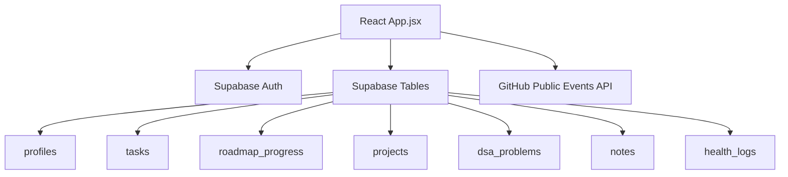
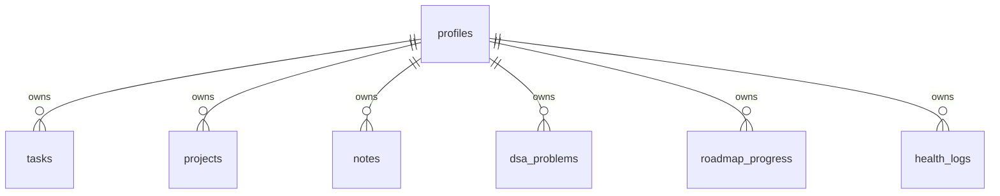
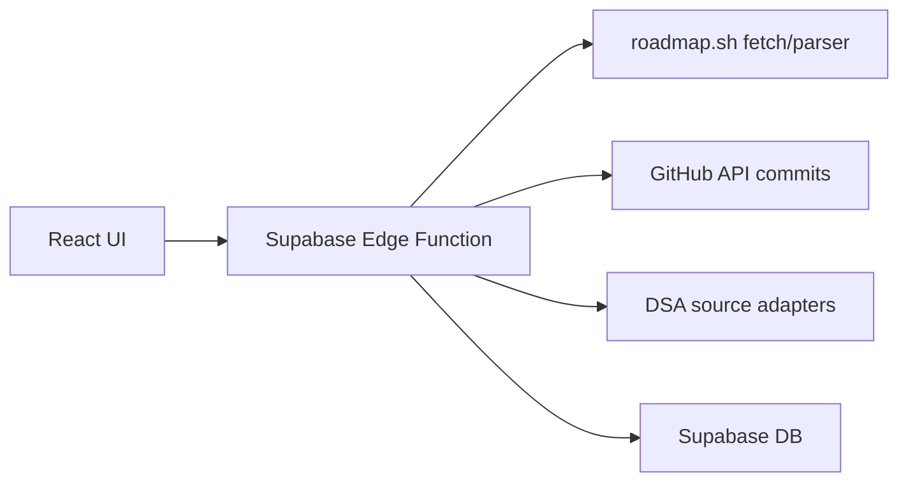

# Moonstack App Context

Moonstack is a React + Supabase career operating system for AI engineer preparation. It tracks daily tasks, roadmap progress, projects, DSA, notes, GitHub activity, calendar progress, and health habits.

## Current Architecture

## Main Screens

- Dashboard: task summary, weekly charts, GitHub heatmap.
- Daily Planner: add tasks, priorities, tags, Pomodoro, suggested roadmap tasks.
- Calendar: date-wise tasks and month completion progress.
- Career Roadmaps: built-in AI engineer roadmap plus roadmap.sh link planner.
- Projects: editable stack, architecture, features, README import, GitHub/demo links.
- Projects GitHub button: calls the `github-commit` Supabase Edge Function to commit a generated or saved README.
- DSA Tracker: problem list by category, difficulty, confidence, status.
- Notes Vault: main topic folders like Python, files like 1. Introduction, markdown snippets for tables and flowcharts.
- Health Monitor: daily mood, sleep, water, activities, notes.
- Settings: profile links, daily targets, password update.

## Data Model

Run `supabase_moonstack_upgrade.sql` after the original schema so the new screens can save all fields.

## Important Limitations

- roadmap.sh crawling cannot be done reliably from only frontend JavaScript because many sites block scraping and CORS.
- GitHub auto-commits must not use a token stored in React. Use a Supabase Edge Function or Netlify/Vercel serverless function.
- LeetCode does not provide a simple public official REST API for all problem automation. Use public links or a backend integration.
- Current app is mostly in one large `src/App.jsx`, which is simple to deploy but should later be split into components.

## Recommended Backend Add-ons

Keep API tokens in serverless environment variables, never in `VITE_*` variables.

## GitHub Commit Setup

1. Create a fine-grained GitHub token with Contents Read/Write access for selected repositories.
2. In Supabase CLI, run `supabase secrets set GITHUB_TOKEN=github_pat_xxx`.
3. Deploy `supabase/functions/github-commit/index.ts` with `supabase functions deploy github-commit`.
4. In Moonstack Projects, add a GitHub repo URL, write README/project details, then press the GitHub icon on the project card.

## Interview Questions

1. Why use Supabase RLS?
Answer: Every table stores `user_id`; RLS ensures users can only read and write their own data even if the frontend is modified.

2. Why should GitHub commits use a backend?
Answer: Personal access tokens are secrets. Frontend bundles are public, so commit actions need a serverless function.

3. How does the notes vault organize notes?
Answer: `folder` is the main topic and `title` is the file name. Content is markdown-style text with snippets for tables, bullets, flowcharts, and code.

4. What caused the blank Projects screen?
Answer: The previous Projects header had an edit button that referenced `p` outside the project loop, causing a runtime exception.

5. How is the app deployable?
Answer: It is a Vite React app. Set `VITE_SUPABASE_URL` and `VITE_SUPABASE_ANON_KEY` on Vercel or Netlify, then run `npm run build`.
