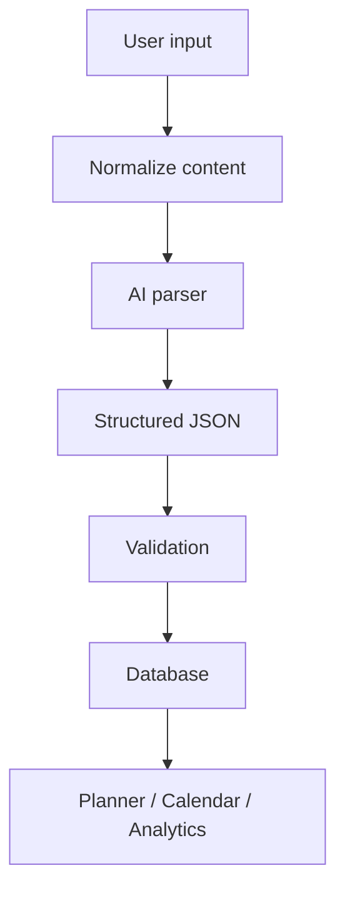

# AI System

## Current State

AI features are currently conceptual and local-rule based. The roadmap generator creates structured plans from links and text, but it does not yet call an AI model.

## Useful AI Features

- roadmap parsing
- weak-topic detection
- revision suggestions
- DSA recommendations
- project recommendations
- interview readiness scoring
- notes summarization
- flashcard generation

## Future AI Flow

## Prompt Design Rules

- Return structured JSON.
- Include confidence and assumptions.
- Never overwrite user data without confirmation.
- Always preserve source links.
- Generate small actionable tasks, not vague advice.

