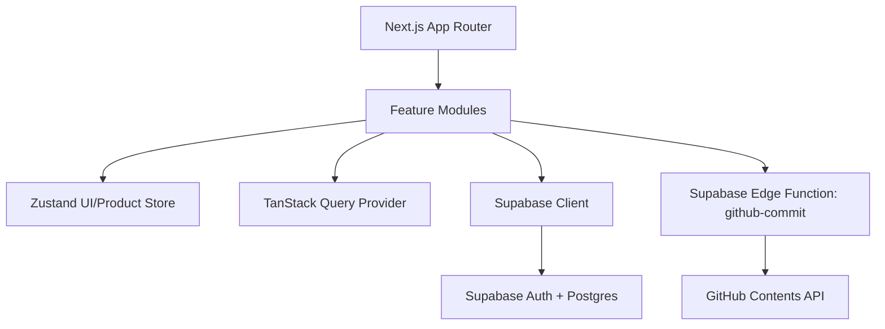
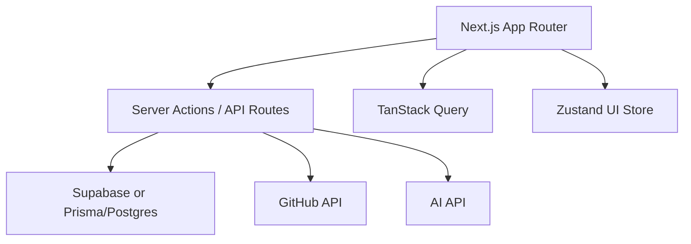

# Architecture

## Current Architecture



## Legacy Weaknesses

- Most UI and logic lives in `src/App.jsx`.
- No typed data layer.
- No query cache.
- Duplicate old and new components exist during iteration.
- Database calls are spread across UI components.
- Layout is not yet componentized into a true app shell.

## Implemented New Structure

```text
app/
  layout.tsx
  page.tsx
components/
  ui/
features/
  shell/
  views/
lib/
  types.ts
  supabase.ts
  utils.ts
store/
  moonstack-store.ts
```

## Target Architecture



## Migration Plan

1. Next.js App Router foundation.
2. Modular feature views.
3. Typed domain models.
4. Zustand product/UI store.
5. TanStack Query provider.
6. Supabase data access layer.
7. Future Prisma-backed API routes when server-side normalized workflows are needed.

This avoids breaking the working app while moving toward production architecture.
