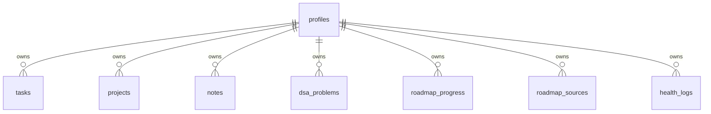
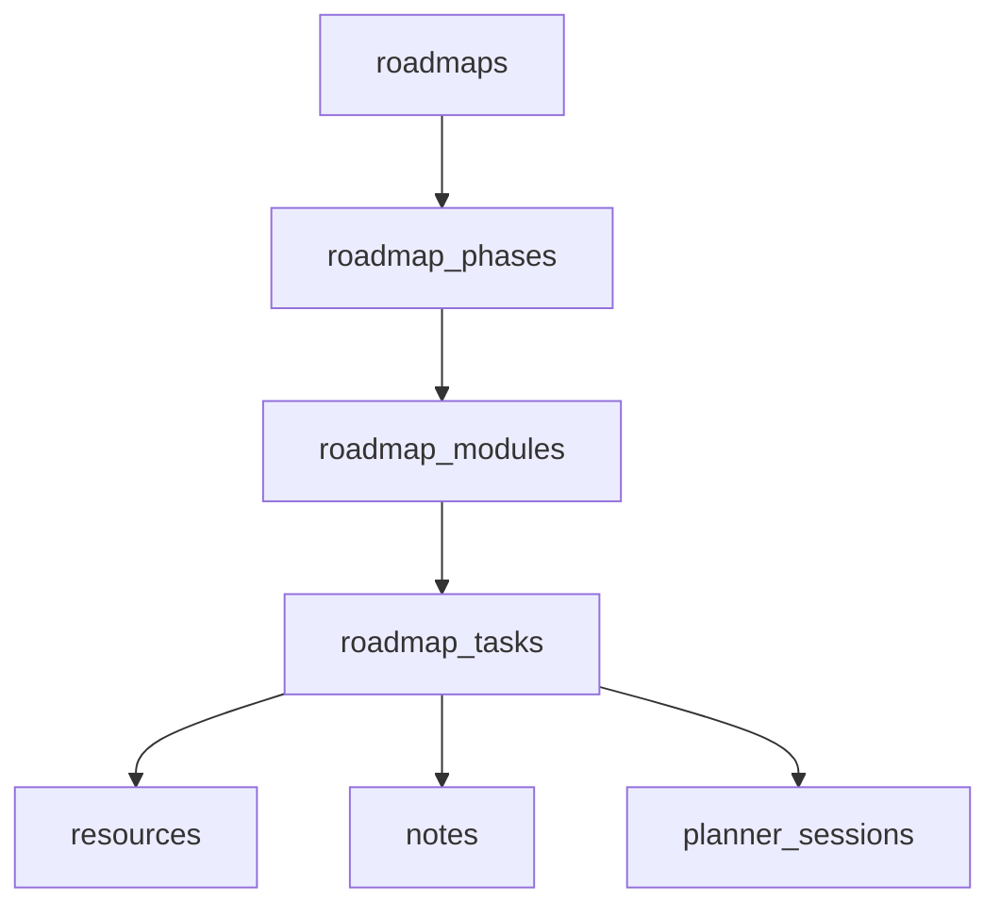
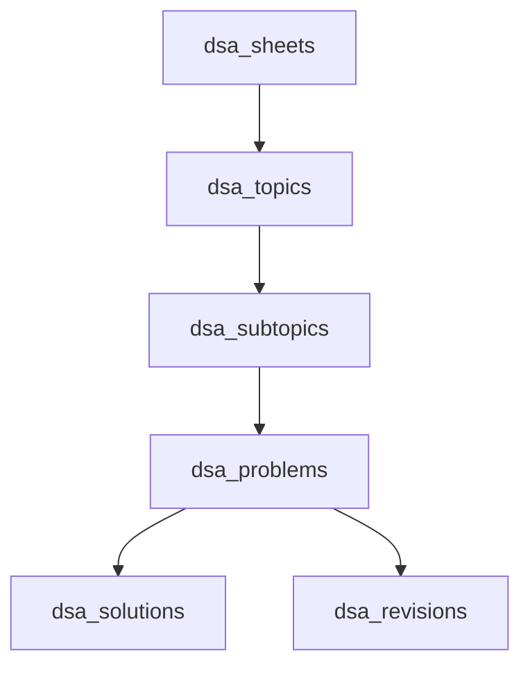

# Database

## Current Tables



## Tables

- `profiles`: user profile, links, targets.
- `tasks`: daily planner and calendar tasks.
- `projects`: builder/project documentation.
- `notes`: second brain notes.
- `dsa_problems`: DSA practice and solution notes.
- `roadmap_progress`: built-in roadmap checkbox state.
- `roadmap_sources`: generated/imported roadmap plans.
- `health_logs`: mood, sleep, water, activities.

## Important Migration

Run:

```sql
supabase_moonstack_upgrade.sql
```

This adds project fields, DSA solution fields, health logs, and roadmap persistence.

## Future Normalized Schema

Roadmaps should become:



DSA should become:



